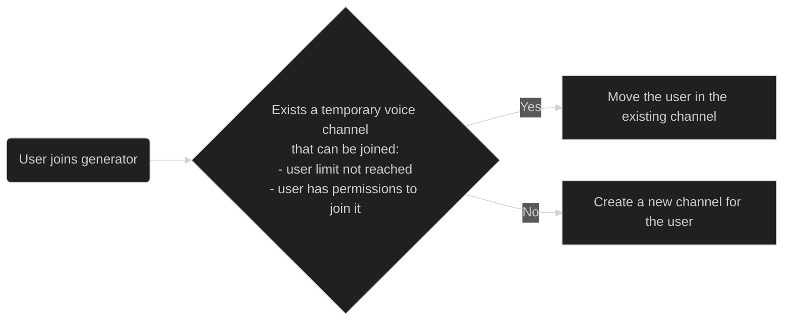

A generator is the channel that users can join to create a new temporary voice channel.  
All the generator commands can be found with [!badge /commands Category:Generators] 

!!!success
Astro can handle ✨ **multiple generators** and **each with different settings**!
!!!

## Create a generator
Use the [!badge /generator create] command to create one.  
!!!primary
Non-[premium](../premium) servers have up to three generators, while [premium](../premium.md) ones have unlimited.
!!!

## Configure a generator
### Voice channel settings
- Category :icon-arrow-right: [!badge /generator vc category]
- Position :icon-arrow-right: [!badge /generator vc position]
- Name :icon-arrow-right: [!badge /generator vc name] (see [variables](variables.md))
- User limit :icon-arrow-right: [!badge /generator vc limit]
- Bitrate :icon-arrow-right: [!badge /generator vc bitrate]
- Region :icon-arrow-right: [!badge /generator vc region]
- Permission inheriting :icon-arrow-right: [!badge /generator vc permissions]
!!!warning Permissions
The [!badge /generator vc permissions] sets where the temporary voice channels inherit the permissions from.  
- None, they will not have any default permission
- Generator, they will copy the permissions of the generator
- Category, permissions will get synced with the category

It will also ask for a `target-role`. The target role is the role that will get modified when the channel gets locked, hidden, etc...  
For example if a user locks the channel (see [user commands](user-commands.md)) then Astro will deny the [!badge variant="danger" text="Connect"] permission to the target role.
!!!

### Voice text chat
Astro can send a message in the integrated text chat of the temporary voice channels  automatically when they get created.  
You can configure the message with [!badge /generator chat message], remember it can include [variables](variables.md), it can even send an **[Interface](interfaces.md)** in them!
[!ref Interfaces](interfaces.md)

### Separate text chat
Astro can also create a separate text channel for each temporary voice channel created.  
Those separate channels are only visible to the users inside the related voice channel and will get deleted when the voice channel gets empty.  

!!!warning
It's not recommended to have separate text channels!  
If you really need it you can enable this feature with [!badge /generator chat creation].
!!!

Here are the available settings:
- Category :icon-arrow-right: [!badge /generator chat category]
- Name :icon-arrow-right: [!badge /generator chat name] (see [variables](variables.md))
- Nsfw :icon-arrow-right: [!badge /generator chat nsfw]
- Slowmode :icon-arrow-right: [!badge /generator chat slowmode]
- Topic :icon-arrow-right: [!badge /generator chat topic]
- Permission inheriting :icon-arrow-right: [!badge /generator chat permissions]

### Queue mode
When queue mode gets enabled with [!badge /generator vc queue], Astro will work in the following way:  

### Ownership settings
#### Owner permissions
You can assign specific permissions to voice channel owners with [!badge /generator owner permissions].
#### Owner role
You can set a role that will be given to the owners of the voice channels with [!badge /generator owner role].  
The role will get removed from them when they leave the voice channel or lose its ownership.  

In this way you can create some text channels where the owners can get information on how to manage their temporary voice channel and make that text channel visible only to the `owner role`.

### Advanced permissions
You can have voice channels created with some initial permissions either simply by inheritance, like already explained above, or via **states**.  

There are 3 default states for voice channels:
- Unlocked
- Locked - users have no access ([!badge variant="danger" text="Connect"] permission is denied)
- Hidden - users can't see the channel ([!badge variant="danger" text="View channel"] permission is denied)

You can make a generator create temporary voice channels with a default state via [!badge /generator vc state].  

#### Moderators
Most of the servers have moderators, that's why there is a `moderator-role` option in the [!badge /generator vc permissions] command.  

Once you set a moderator role there, that role will be able to **join any locked or hidden voice channel** and will be able to **claim the ownership** of the voice channels with [!badge /vc claim].
### Advanced naming
#### Name x State
You can configure a name for each *state* of the channels simply by specifying the state in [!badge /generator vc name].  

==- 🦀 Example
You can do:
- [!badge /generator vc name name:`Opened by {nickname}` state:`Any`]
- [!badge /generator vc name name:`Closed by {nickname}` state:`Locked`]
- [!badge /generator vc name name:`Hidden by {nickname}` state:`Hidden`]

That way when a user, lets say [!badge variant="info" text="Xavin"] creates a channel it will be called :icon-unmute: `Opened by Xavin`, once locked it will turn into :icon-unmute: `Closed by Xavin` and once hidden :icon-unmute: `Hidden by Xavin`.
===

#### Name refreshing and updating
You can also configure **when** Astro should rename a channel with the command [!badge /generator vc rename-conditions].  
The command will show four options that you can enable or disable:
- `state-change` - whether Astro should update the channel name if the channel gets unlocked, locked or hidden
- `owner-change` - whether the name should be updated if the owner of the channel changes
- `renamed` - whether Astro should update the channel name (for any possible reason) even if it has already been manually renamed by the owner with `/vc name`
- `activity-change` - whether the name should be updated when the activity of owner of channel changes (for example when he starts / switches games, play a song on soundcloud, etc...)

!!!success Variables
You can make use of variables in the voice channel names!
[!ref](variables.md)
!!!
