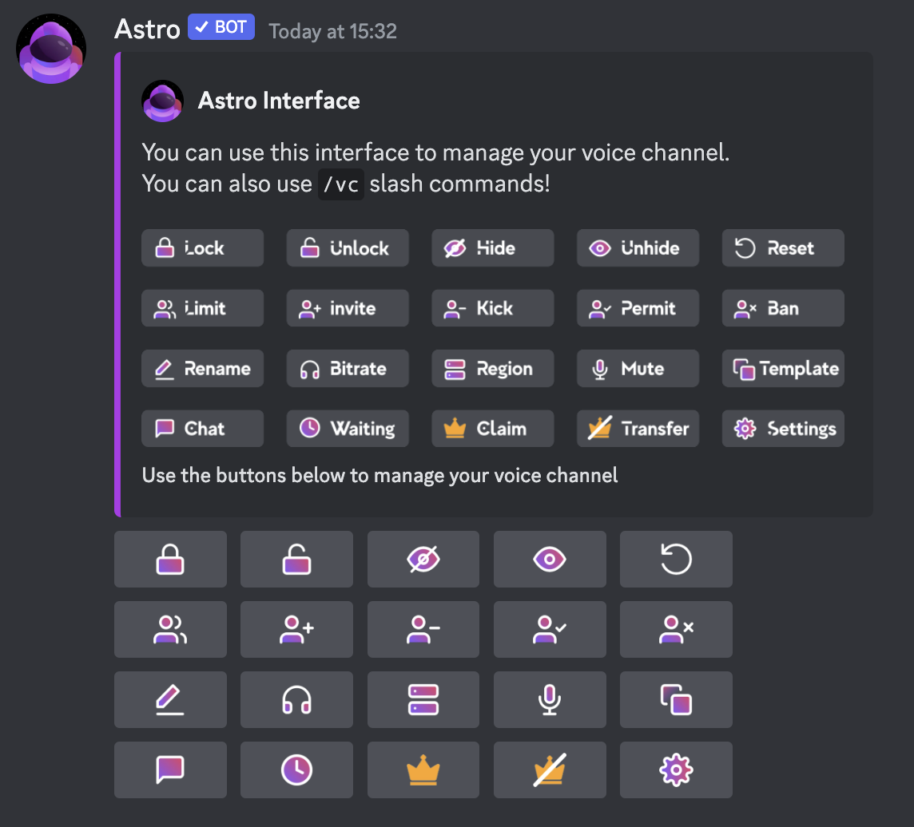

Interfaces are a way for users to manage their temporary voice channels via simple buttons.  
==- 🦀 Default interface

===

==- 🦀 Gaming interface example

===

### Creating interfaces
You can create a new interface for your server with [!badge /interface create].  
Interface are global and can be used to manage any temporary voice channel of the server.  
!!!info
Non-[premium](../premium.md) server can have at max 1 interface, while [premium](../premium.md) don't have a limit of interfaces.
!!!

!!!warning
Delete an interface at any time with [!badge /interface delete].
!!!

### Switching the channel
You can move the interface to another text channel with [!badge /interface edit channel].

### Editing an interface
You can edit both the message of the interface and the buttons (see the gaming example above).  

#### Edit the message
To edit the message of the interface use [!badge /interface edit message].  
You can edit every aspect of the message and remove them via the `remove` option.  
==- :icon-repo: Embed structure

===
You can also enable `automatic fields`, Astro will create a description for each command of the interface automatically.

#### Edit the buttons
You can add and remove buttons respectively with [!badge /interface add button] and [!badge /interface remove button].  
A button is editable with [!badge /interface edit button] and switch up their order with [!badge /interface edit button-order].  
==- :icon-repo: Button styles

A button can also be made up of only an emoji.
===
